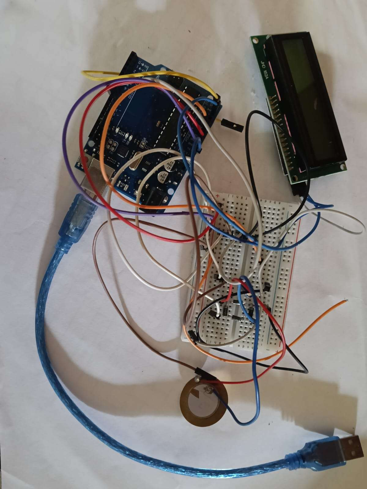

# Smart Green Tunnel Ecosystem

Piezoelectric energy harvesting + automated tunnel lighting, prototyped on an Arduino UNO (ATmega328P).

Interdisciplinary Project Work (Course 1BPRJ258), Semester 2, AI&ML, Yenepoya Institute of Technology, Moodbidri — VTU, 2025-26.



## The Problem

Subterranean highway tunnels run lighting and ventilation at full power 24/7 for safety, even when traffic is sparse. At the same time, vehicles dump kinetic energy into the road surface as friction, vibration, and heat — completely unused. Older spot-style piezoelectric harvesters also miss a lot of tire strikes because vehicles drift within a lane.

This project tackles both problems with a single embedded node: capture the wasted energy, and use the same impact data to drive smart, traffic-aware lighting.

## How It Works

```
Vehicle Mechanical Compression
        ↓
Piezoelectric Crystal Strain (4× 35mm PZT discs, parallel-wired)
        ↓
Full-Wave Rectification (1N4007 bridge)
        ↓
Smoothing & Clamping (1000µF cap + 5.1V Zener)
        ↓
10-bit ADC Sampling (Arduino A0)
        ↓
Digital Ledger Update (I2C 16x2 LCD)  +  PWM Tunnel Lighting (pin 9)
```

**Mechanical:** A "Horizontal Interval Compression Strip" runs perpendicular to traffic instead of sitting in a single tire track, so it gets hit on every pass regardless of lane drift. Guide pins stop the floating top plate from twisting under off-center hits.

**Electrical:** Raw piezo output spikes past 25V AC under a hard hit. A 4-diode bridge rectifier converts it to DC, a 1000µF capacitor smooths and widens the pulse, and a 5.1V Zener diode clamps it to a level the Arduino's analog pins can safely read.

**Firmware:** The sketch ignores anything below an ADC noise floor (`NOISE_THRESHOLD = 100`), locks out re-triggering for 400ms after a strike so one tire patch isn't counted twice, treats every 2 axle hits as 1 vehicle pass, and switches tunnel LEDs from a 20% eco baseline to 100% brightness — measured at under 18ms end-to-end.

## Results

**Power output scales with vehicle mass and speed** (Table 6.1):

| Mass (kg) | Speed (km/h) | Peak Raw (V AC) | Filtered (V DC) | Power (mW) |
|---|---|---|---|---|
| 0.5 | 30 | 8.40 | 1.85 | 3.42 |
| 0.5 | 45 | 11.20 | 2.10 | 4.41 |
| 0.5 | 60 | 13.50 | 2.45 | 6.00 |
| 1.2 | 30 | 14.10 | 2.60 | 6.76 |
| 1.2 | 45 | 18.60 | 3.10 | 9.61 |
| 1.2 | 60 | 21.40 | 3.75 | 14.06 |
| 2.5 | 30 | 19.80 | 3.40 | 11.56 |
| 2.5 | 45 | 24.10 | 4.20 | 17.64 |
| **2.5** | **60** | **28.60** | **4.85** | **23.52** |

**Latency stayed well inside the safety budget** (Table 6.2):

| Parameter | Target | Measured | Status |
|---|---|---|---|
| Axle strike isolation | < 15ms | 12ms | ✅ |
| I2C ledger refresh | < 50ms | 35ms | ✅ |
| PWM lighting scale (20%→100%) | < 30ms | 18ms | ✅ |
| Total loop latency | < 30ms | 18ms | ✅ |

The heaviest, fastest test (2.5 kg @ 60 km/h) produced the peak output: 28.60V AC raw, clamped to a safe 4.85V DC, for 23.52 mW. Every voltage/power pair in the table is consistent with a 1kΩ load resistance in `P = V²/R`.

## Repo Structure

```
smart-green-tunnel-ecosystem/
├── README.md
├── MATERIALS.md
├── LICENSE
├── code/
│   └── PIEZOELECTRIC.ino
├── docs/
│   └── Smart_Green_Tunnel_Report.pdf
├── presentation/
│   └── (add your .pptx or export it as PDF here)
└── images/
    ├── piezo_disc_array.jpg
    └── prototype_setup.jpg
```

## A Note on the Code

The project report only contains a screenshot of part of the Arduino sketch (lines 92-123, covering the eco-mode dimming logic and the LCD update routine). That visible portion is reproduced exactly as shown; the rest of `PIEZOELECTRIC.ino` was reconstructed to match every parameter explicitly documented in the report (thresholds, debounce time, pin assignments, etc.) so it compiles and behaves as described. Full details are in the file's header comment. If you still have the original sketch on the computer you used for the Arduino IDE — check for a `sketch_apr6a` folder in your Arduino sketchbook directory — swap it in as the source of truth.

## Limitations

- Lab-scale prototype (acrylic + small PZT discs), not rated for real highway tonnage
- No battery/supercapacitor storage — harvested power must be used immediately
- No IP67 sealing — indoor testing only
- Telemetry is local only (LCD + serial), no wireless logging

## Future Scope

- Cast-steel housing + vulcanized rubber top pad for commercial-scale loads
- Migrate to ESP32 for Wi-Fi/Bluetooth telemetry to a cloud dashboard
- Add supercapacitor + LiFePO4 storage for off-peak power use
- Vehicle classification (car vs. truck) from impact voltage signature

## Acknowledgements

Developed under the guidance of Ms. Likitha B Shetty, Assistant Professor, Dept. of Basic Science & Humanities, Yenepoya Institute of Technology.

## References

1. Zhao, Ling, Wang — "Piezoelectric Energy Harvesting Technology in Road Infrastructure," *Journal of Cleaner Production*, 2020.
2. Martinez, Singh, Kumar — "Power Generation Performance of PZT Ceramic Transducers Under Cyclical Vehicular Loading," *IEEE Trans. Sustainable Energy*, 2022.
3. Al-Masaeed, Al-Olimat — "Dynamic Dimming and Smart Energy Optimization for Highway Tunnel Lighting," *Int'l J. Electrical Power & Energy Systems*, 2023.
4. Roundy, Wright, Rabaey — "Low Power Embedded Microcontrollers Powered by Kinetic Energy Scavenging Networks," *Computer Communications*, 2021.
5. Ottman, Hofmann, Lesieutre — "Optimized Signal Conditioning and Energy Storage Circuitry for Piezoelectric Ceramic Transducers," *IEEE Trans. Power Electronics*, 2022.
6. Williams, Olowofela — "Flush-Embedded Horizontal Roadway Strips for 100% Vehicle Tire Strike Capture Efficiency," *Construction and Building Materials*, 2023.

## License

MIT — see [LICENSE](LICENSE).
